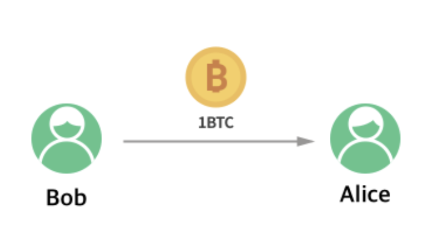

# BlockChain

## 화폐의 역사
사람들은 필요한 물품을 구하기 위해 수렵, 채집에서 발전한 물물 교환을 시작했다.  
하지만, 서로가 원하는 물건의 종류, 품질, 양 혹은 운반상의 불편함을 느끼고 교환에 필요한 중간 매개체가 필요하게 되었는데  
여기서 화폐가 생겨나게 되었다.

## 화폐의 조건
1. 매개체 : 화폐는 교환이 가능한 매개체여야 한다.
2. 휴대성 : 소지가 간편해야 한다.
3. 분할성 : 잔돈을 만들 수 있어야 한다.
4. 내구성 : 시간이 지나도 그 형태를 유지하여야 한다.
5. 회계성 : 셀 수 있는 단위가 존재하여 회계 가능하여야 한다.

## 화폐와 돈의 차이점
화폐와 돈은 앞서 말한 5가지 특징을 가지고 있다.  
하지만 화폐와 돈을 구분할 수 있는 한가지 특징이 더 있는데  
돈은 오랜 세월 속에서도 가치를 유지해야 한다.  
즉, 그 양이 한정적이어야 한다는 말이다.  

세계적으로 성공한 화폐는 단 한개도 없다고 한다. 성공의 기준이 모호하지만, 금은 자원이 한정적이고 만들어 낼 수 없다.  
이러한 이유로, 금은 아주 오래전부터 지금까지 가치를 유지할 수 있었다.  

앞으로 언급할 블록체인도 돈과 아주 유사하다.  

한 예시로 비트코인은 화폐의 조건을 충족하면서도 발행량이 2100만개로 한정되어있다.  한정되어 있다는 뜻은 채굴자에게 주는 보상이 2100만개로 수렴하도록 설계되어 있다는 이야기다.

## 블록체인이란?

> 탈 중앙 분산 거래장부  

- 거래가 발생하게 되면 그 거래정보는 블록체인 네트워크로 전송된다.  
- 각 네트워크에 참여하는 모든 노드들이 그 거래를 저장한다.
- 작업증명을 통해 신뢰할 수 있는 정보로 변경시킨다.  

## 블록체인 탄생배경
- 중앙 기관의 신뢰성 문제
    - 1995년 베어링스 은행 파산사건  
    1989년, 닉 리슨은 베어링스 은행에 입행한 후, 대차대조표와 장부를 교묘하게 조작해 본사에 손실이 보고되지 않도록 손을 썼으며, 본사에서는 그를 신뢰해 더 많은 돈의 관리를 맡겼다.  
    하지만 결국 닉 리슨은 베어링스 은행 자본의 두 배에 달하는 1.5조원의 손실을 냈고,  베어링스 은행은 파산했다.  

    - 2007년 서브프라임 모기지 사태  
    2000년, 미국은 경기가 악화되자 경기부양책으로 초 저금리와 양적완화 정책을 펼쳤다. (부동산 버블 발생)  
    2004년, 정책을 종료하면서 버블이 꺼지기 시작했으며 금리가 올라가 대출자들은 원리금을 갚지 못하게 되고, 여러 금융기관들은 파산을 하게 된다. (경제적 피해 금액 약 4000조원)  

## 블록체인 동작원리 (비트코인 거래 순서)
1. 거래 생성  

- Bob이 Alice에게 1BTC 전송 의사표시.  

2. 거래 서명  

- Bob이 해당 거래에 서명을 해야 비트코인 송금에 관한 정보가 담긴 거래정보가 발생.  

3. 거래정보 전송
- 거래정보를 둘만 알고있어서는 거래가 성사될 수 없다. 즉, 비트코인 네트워크에 전송되어야한다. 수 많은 비트코인 노드중 하나에 거래정보가 도달 하게 된다.
    - 노드 : 블록체인을 배포하는 소프트웨어를 갖고 블록체인을 다운받는 사람 또는 컴퓨터  

4. 거래정보 전파  

- 거래정보가 하나의 노드에 도달하면 비트코인 네트워크상에 있는 모든 노드에게 이 거래정보를 전파한다.
- 정보를 전파받은 빨간색으로 표시된 채굴노드들이 작업증명(Proof of work 알고리즘) 과정을 거쳐 연산을 먼저 완료하는 노드가 블록에 거래를 기록하게 되고 보상으로 BTC를 받음
    - 4년마다 보상이 1/2로 줄어든다. (2100만개 수렴)  

5. 거래완료  
4번 과정에서 거래정보가 영구적으로 블록에 기록 됬다면, 이제 진짜로 Bob이 Alice에게 1BTC를 전송했다고 할 수 있는 것이다. 이렇게 기록된 정보는 이후에 위,변조가 불가능하다.  
[블록체인 시뮬레이터](https://blockchaindemo.io/)  
> 첫 번째 블록 : 제네시스 블록
>> 비트코인 제네시스블록의 내용  
The Times 03/Jan/2009 Chancellor on brink of second bailout for banks  
더 타임스 2009년 1월 3일 은행의 두 번째 구제 금융을 앞둔 재무 장관  

## 블록체인의 장점
- 분산성
    - 대개 수천개의 분산화된 네트워크 노드에 저장되기 때문에, 시스템과 데이터는 기술적 실패와 악의적 공격에 대한 강한 저항력을 갖는다.
    - 각 네트워크 노드는 데이터베이스 사본을 복제하고 저장할 수 있으며, 노드가 오프라인으로 전환하더라도 네트워크 이용과 보안에 영향을 미치지 않는다.
- 안정성
    - 승인된 블록들은 되돌리기가 무척 어려우며, 이는 데이터가 블록체인에 기록된 다음에는 이를 삭제하거나 변경하기가 무척 어려움을 뜻한다.
- 신뢰가 필요 없는 시스템
    - 전통적인 거래시스템에서, 두 당사자는 제3자에 의해 의존했다. 하지만 블록체인을 사용하면 중개자가 필요없고, 이는 전체적인 비용과 거래 수수료를 절감할 수 있다.

## 블록체인의 단점
- 데이터 수정
    - 블록체인에 데이터가 기록되면 이를 수정하기가 무척 어렵다는 것이다. 안정성은 블록체인의 장점이긴 하지만, 이것이 언제나 좋은 것은 아니다. 블록체인 데이터나 코드를 변경하는 것은 매우 까다로우며, 한 체인이 버려지고 다른체인이 이를 대신하는 하드포크를 종종 필요로 한다.  
- 프라이빗 키
    - 블록체인은 공개키 암호학을 사용해 사용자가 자신의 암호 화폐 자산에 소유권을 주장할 수 있게 한다. 사용자가 만약 프라이빗 키를 잃어버리게 된다면, 사실상 자금일 잃게되며, 이를 해결할 방법이 없다.
- 비효율성
    - 작업 증명을 사용하는 블록체인은 상당히 비효율적이다. 채굴경쟁이 치열하고, 매 10분마다 단 한명의 승자만 존재하기 때문에, 다른 모든 마이너들의 작업은 무용지물이 된다.
- 저장 공간
    - 블록체인 장부는 시간이 지나며 거대해질 수 있다. 비트코인 블록체인은 현재 200GB의 저장공간을 필요로 한다. 블록체인 규모의 성장속도는 하드 드라이브의 성장 속도를 앞지를 것으로 보이며, 원장이 너무 커져 개인이 이를 다운로드 하거나 저장할 수 없게 되면, 노드를 잃게 될 위험이 있다.

## 블록체인 적용사례
- 이미지 저작권분야 : [코닥원](https://kodakone.com/)
    - 사진작가가 코닥원에 작품을 등록하면 해당 정보에 대한 디지털 코드가 생성된다.
    - 해당사진의 구매가 발생하면 스마트 컨트랙트를 통해 비용이 지불된다.
    - 뿐만 아니라 웹 크롤링을 통해 허가받지 않은 이미지를 탐지하여 통지 및 법적인 조치까지 구현하려는 계획을 가지고 있다.  

- SNS 분야 : [스팀잇](https://steemit.com/)
    - 글을 게시해 페이스북 ‘좋아요’와 같은 추천을 많이 받으면 보상이 지급되는 서비스이다.
    - 작성자는 글의 조회수와 인지도에 따라 Steem으로 보상받으며 암호화폐 거래소를 통해 환전 받을 수 있는 구조이다
    - 광고수익 없이 독자들에게 투표를 받아 수익을 창출하기 때문에 커뮤니티 전제 콘텐츠 품질 향상  

- 미래 예측을 위한 베팅 플랫폼 : [어거](https://www.augur.net/)
    - 2014년 이더리움 플랫폼 기반으로 만든 DApp중 하나
    - 어거는 이용자들이 특정 주제에 대한 찬반 등을 올리면 어느 한쪽에 토큰을 걸어 투자할 수 있는 형태의 서비스다.
    - 자신이 건 쪽이 실제 일어나면 투자 수익을 얻는 구조다.  
    - 활용
        - 정치예측
        - 날씨예측
        - 기업예측
        - 이벤트 헤징

## 블록체인 미래
- [HyperLedger](https://github.com/hyperledger)
    - 리눅스 재단에서 주관하는 블록체인 오픈소스 프로젝트
    - 금융, IoT, 물류, 제조, 기술 산업 등 여러 산업에 걸쳐 응용 가능한 블록체인 기술을 만드는 것이 목표
